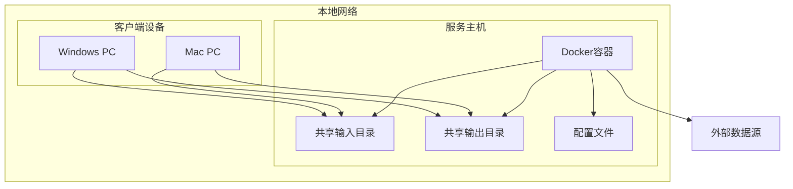
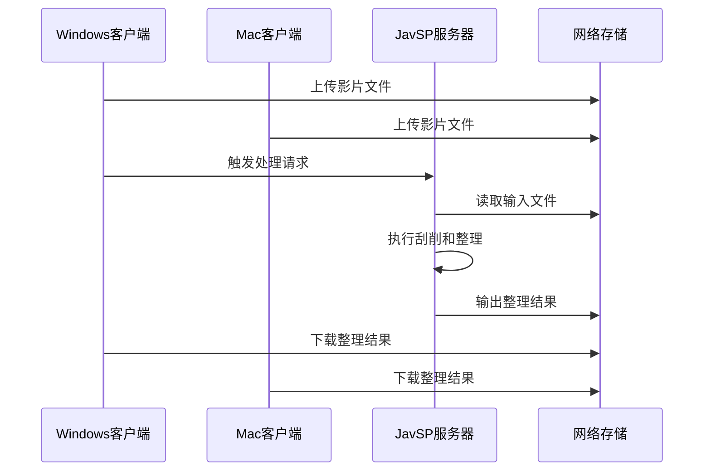
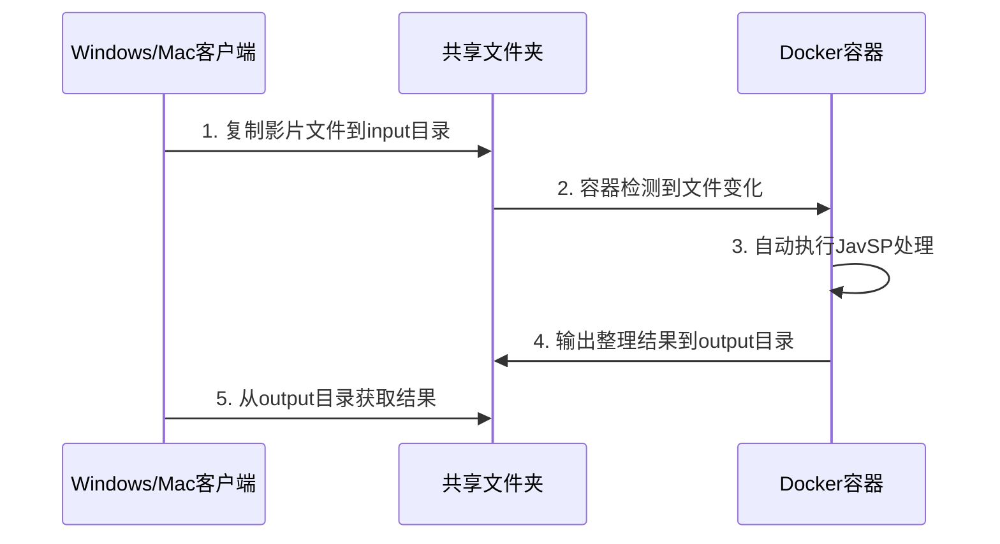

# JavSP 本地网络配置设计文档

## 项目概述

JavSP是一个AV元数据刮削器，通过汇总多个站点数据来整理影片文件。本设计文档描述如何在本地网络中部署JavSP项目，使Windows和Mac终端都能访问和使用该服务。

## 技术栈分析

基于项目分析，JavSP具有以下特点：
- Python CLI工具 (Python 3.10+)
- 支持Docker容器化部署
- 配置文件驱动 (config.yml)
- 包含数据爬取、处理和整理功能
- 支持多个数据源网站抓取

## 架构设计

### 推荐方案：Docker容器化本地网络部署



### 方案优势

- **稳定性高**: Docker容器隔离环境，避免依赖冲突
- **部署简单**: 一键启动，无需复杂配置
- **跨平台**: Windows和Mac都能无缝访问
- **易维护**: 容器化管理，升级回滚方便
- **资源控制**: 可限制CPU和内存使用

## 详细实现方案

### 服务端部署步骤

#### 1. 准备服务器环境

**安装Docker**
```bash
# Windows
# 下载Docker Desktop并安装

# Mac  
brew install --cask docker

# Linux
curl -fsSL https://get.docker.com -o get-docker.sh
sudo sh get-docker.sh
```

#### 2. 创建项目目录结构

```bash
mkdir -p javsp-server/{config,input,output,data}
cd javsp-server
```

**目录结构**
```
javsp-server/
├── docker-compose.yml
├── config/
│   └── config.yml
├── input/           # 影片输入目录
├── output/          # 整理后输出目录
└── data/            # 数据文件
```

#### 3. 创建docker-compose.yml

```yaml
version: '3.8'
services:
  javsp:
    image: javsp:latest
    build:
      context: .
      dockerfile: Dockerfile
    container_name: javsp-server
    volumes:
      - ./config/config.yml:/app/config.yml:ro
      - ./input:/app/input
      - ./output:/app/output
      - ./data:/app/data
    environment:
      - PYTHONUNBUFFERED=1
      - TZ=Asia/Shanghai
    restart: unless-stopped
    command: ["-i", "/app/input"]
    healthcheck:
      test: ["CMD", "ls", "/app"]
      interval: 30s
      timeout: 10s
      retries: 3
```

#### 6. 设置网络共享

**Windows服务端 (SMB共享)**
```cmd
# 开启文件共享功能
# 控制面板 -> 程序和功能 -> 启用或关闭Windows功能 -> SMB 1.0/CIFS文件共享支持

# 共享输入目录
net share javsp-input=D:\javsp-server\input /grant:everyone,change

# 共享输出目录  
net share javsp-output=D:\javsp-server\output /grant:everyone,read

# 查看共享
net share
```

**Mac/Linux服务端 (Samba)**
```bash
# 安装Samba
sudo apt install samba  # Ubuntu/Debian
brew install samba      # macOS

# 编辑配置文件
sudo nano /etc/samba/smb.conf

# 添加共享配置
[javsp-input]
    path = /path/to/javsp-server/input
    browseable = yes
    writable = yes
    guest ok = yes
    read only = no

[javsp-output]
    path = /path/to/javsp-server/output
    browseable = yes
    writable = no
    guest ok = yes
    read only = yes

# 重启服务
sudo systemctl restart smbd
```

### 客户端使用指南

#### Windows客户端操作

**1. 连接共享文件夹**
```cmd
# 打开资源管理器，地址栏输入
\\<服务器IP>

# 或使用命令行映射网络驱动器
net use J: \\<服务器IP>\javsp-input
net use K: \\<服务器IP>\javsp-output
```

**2. 使用步骤**
```cmd
# 复制影片文件到输入目录
copy "C:\Movies\movie.mp4" J:\

# 触发处理(容器会自动检测文件变化)
# 或手动重启容器
docker restart javsp-server

# 查看处理结果
dir K:\
```

#### Mac客户端操作

**1. 连接共享文件夹**
```bash
# 使用Finder连接服务器
# 菜单栏: 前往 -> 连接服务器 -> smb://<服务器IP>

# 或使用命令行挂载
sudo mkdir -p /Volumes/javsp-input /Volumes/javsp-output
mount -t smbfs //<服务器IP>/javsp-input /Volumes/javsp-input
mount -t smbfs //<服务器IP>/javsp-output /Volumes/javsp-output
```

**2. 使用步骤**
```bash
# 复制影片文件
cp "~/Movies/movie.mp4" /Volumes/javsp-input/

# 查看处理进度(可选)
docker logs javsp-server

# 查看处理结果
ls /Volumes/javsp-output/
```


## 网络配置

### IP地址规划

**服务器设置**
- 推荐使用静态IP地址
- 记录服务器IP地址供客户端连接使用
- 确保所有设备在同一网段

**客户端发现**
```bash
# 查找服务器IP
ping javsp-server.local  # 如果配置了mDNS
# 或扫描网段
nmap -sn 192.168.1.0/24
```

## 配置文件调整

### 网络代理配置

```yaml
network:
  proxy_server: null  # 如需代理
  timeout: PT30S      # 增加超时时间
  retry: 5            # 增加重试次数
```

### 路径配置

```yaml
scanner:
  input_directory: "/shared/input"
  
summarizer:
  path:
    output_folder_pattern: '/shared/output/{actress}/[{num}] {title}'
```

### 并发配置

```yaml
crawler:
  sleep_after_scraping: PT0.5S  # 降低延迟
  
extra_fanarts:
  scrap_interval: PT1S          # 调整抓取间隔
```

## 监控和日志

### 日志配置

**服务端日志**
```bash
# 创建日志目录
mkdir -p /var/log/javsp

# 配置logrotate
sudo nano /etc/logrotate.d/javsp
```

**监控脚本**
```python
import psutil
import logging

def monitor_javsp_process():
    # 监控JavSP进程状态
    pass

def check_disk_space():
    # 检查磁盘空间
    pass
```

### 性能优化

**资源限制**
```yaml
# docker-compose.yml
services:
  javsp:
    deploy:
      resources:
        limits:
          memory: 2G
          cpus: '2'
```

**缓存策略**
- 本地缓存元数据
- 图片缓存优化
- 网络请求缓存

## 使用场景和工作流

### 典型工作流



### 批处理模式

**定时任务配置**
```bash
# crontab设置
0 2 * * * /usr/local/bin/javsp -i /shared/input >> /var/log/javsp/cron.log 2>&1
```

**批量处理脚本**
```bash
#!/bin/bash
# batch_process.sh

INPUT_DIR="/shared/input"
OUTPUT_DIR="/shared/output"
LOG_FILE="/var/log/javsp/batch.log"

echo "$(date): 开始批处理" >> $LOG_FILE
javsp -i $INPUT_DIR >> $LOG_FILE 2>&1
echo "$(date): 批处理完成" >> $LOG_FILE
```

### 故障排除指南

**网络连接测试**
```bash
# 测试网络连通性
ping <服务器IP>

# 测试SMB端口
telnet <服务器IP> 445

# Windows查看共享
net view \\<服务器IP>

# Mac测试SMB连接
smbutil view //<服务器IP>
```

**Docker服务检查**
```bash
# 检查容器状态
docker ps
docker-compose ps

# 查看容器日志
docker logs javsp-server

# 进入容器调试
docker exec -it javsp-server /bin/bash
```

**常见问题解决**

1. **无法访问共享文件夹**
   - 检查防火墙设置
   - 确认SMB服务运行
   - 验证网络连通性

2. **容器启动失败**
   - 检查端口占用
   - 验证配置文件语法
   - 查看详细错误日志

3. **处理卡住不动**
   - 检查网络代理设置
   - 验证磁盘空间
   - 重启容器服务

## 日常使用workflow

### 典型使用流程



### 自动化处理

**文件监控脚本** (可选)
```bash
#!/bin/bash
# watch_and_process.sh

INPUT_DIR="/app/input"
LOG_FILE="/var/log/javsp_auto.log"

inotifywait -m -r -e create,moved_to $INPUT_DIR --format '%w%f' |
while read file; do
    echo "$(date): 检测到新文件: $file" >> $LOG_FILE
    sleep 5  # 等待文件传输完成
    python -m javsp -i $INPUT_DIR >> $LOG_FILE 2>&1
    echo "$(date): 处理完成" >> $LOG_FILE
done
```

### 批量处理模式

**定时任务** (在服务器上设置)
```bash
# 编辑crontab
crontab -e

# 每天凌晨2点自动处理
0 2 * * * docker exec javsp-server python -m javsp -i /app/input
```

## 性能优化建议

### 资源配置

**Docker资源限制**
```yaml
# docker-compose.yml 中添加
services:
  javsp:
    deploy:
      resources:
        limits:
          memory: 2G
          cpus: '1.5'
        reservations:
          memory: 512M
          cpus: '0.5'
```

**存储优化**
- 使用SSD存储提高I/O性能
- 定期清理临时文件
- 配置合适的磁盘缓存

### 网络优化

**带宽管理**
- 限制同时处理的文件数量
- 调整网络超时时间
- 使用有线网络连接服务器

**配置调整**
```yaml
# config.yml 性能优化
network:
  timeout: PT60S  # 增加超时时间
  retry: 2        # 减少重试次数

crawler:
  sleep_after_scraping: PT2S  # 增加请求间隔
```